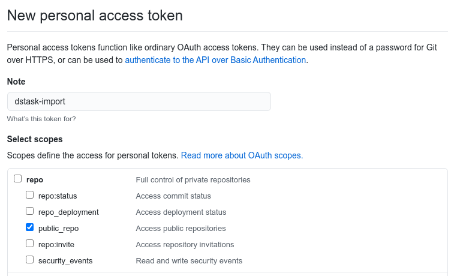
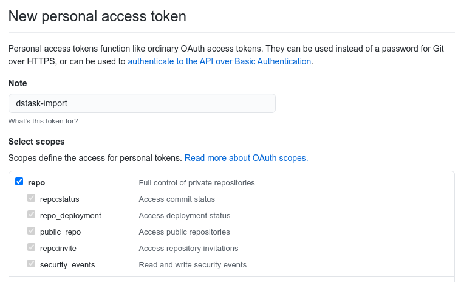

# dstask-import

dstask-import is a tool to synchronize between external services and dstask.
At this point it only supports syncing from GitHub.
The goal currently is to have tasks in dstask that represent tasks in GitHub,
such that a dstask-based workflow (tracking, managing and prioritizing tasks)
can take into account work that is defined in GitHub, although the goal is not to "replace" GitHub,
nor to replicate all information contained in GitHub's issues.

Specifically:

* The sync is one-way (from Github to dstask).
* We only sync key properties (summary etc), not GH comments or dstask notes
* You are expected to close issues in GitHub and then sync to get the task closed in dstask.
* Pull Requests are currently not supported.

## Configuration

First you need to obtain a token. Go to [your token settings in Github](https://github.com/settings/tokens) and hit "Generate new token".

If you only need to query public repositories you only need to enable "public_repo".


If however you need to query private repositories then you need the full control option like so:



Create a file `$HOME/.dstask-import.toml` with one or more github sections.
Each section may look like this:

```
[[github]]
token = "<Github API token>"
repos = ["naggie/dstask", "grafana/grafana"] # one or more "owner/repo" strings
get_closed = true             # get closed tickets in addition to open ones?
assignee = ""                 # if set, only import tickets that have this assignee
milestone = ""                # if set, select only tickets that have this milestone
#labels = ["select", "label"] # if set, only select tickets that have these labels
template_str = """
summary: "GH/{{.RepoOwner}}/{{.RepoName}}/{{.Number}}: {{.Title}}"
tags: ["{{.Milestone}}", "a-tag"]
project: "some-project"
priority: P2
notes: "url: {{.Url}}"`
"""
```

Note:

* selection by Github project not supported yet
* you may have multiple sections that import an overlapping set of tasks, with conflicting directives (e.g. a different template).
  we resolve this as "last directive wins". This is simply the result of executing each section in sequence,
  such that tasks re-imported by later sections may overwrite tasks that were imported by earlier sections.

For templates expansion see templates section below.


## Properties mapping in detail

As a reminder, here are how issues/PR's and tasks are modeled on Github and within dstask respectively.
The 3rd column describes how each field of the synced task is set

| Github properties | dstask properties                          | how the dstask properties are defined                          |
|-------------------|--------------------------------------------|----------------------------------------------------------------|
| repo owner        |                                            |                                                                |
| repo name         |                                            |                                                                |
| number            | uuid                                       | auto-generated based on repo (owner and name) and ticket number|
| title             | summary                                    | summary: template expansion (see below)                        |
| state open/closed | status (pending, active, paused, resolved) | if open in GH default to pending, but leave pre-existing active/paused status intact<br/>if closed in GH: resolved |
| pr vs issue       | priority                                   | template expansion (see below)                                 | 
| author            |                                            |                                                                |
| created timestamp | created timestamp                          | from GitHub                                                    |
| closed timestamp  | resolved timestamp                         | from GitHub (if issue is closed)                               |
|                   | due timestamp                              | not set                                                        | 
| labels            | tags                                       | template expansion (see below)                                 |
| projects          | project                                    | template expansion (see below)                                 |
| milestones        |                                            |                                                                |
| review state      |                                            |                                                                |
| reviewers         | delegatedto (?)                            | not set                                                        |
| assignees         | subtasks                                   | not set                                                        |
| link issue        | dependencies                               | not set                                                        |
| comments          | notes                                      | template expansion (see below). local non-empty pre-existing notes are preserved               |


## Template expansion

As you saw above, each Github section declares a template.
This template declares how certain fields get populated.

The following variables are available for use in each template:

| Name      | type      | info                       |
|-----------|-----------|----------------------------|
| RepoOwner | string    | user/org owning the repo   |
| RepoName  | string    | name of the repository     |
| Author    | string    | issue author name          |
| Body      | string    | issue body text            |
| ClosedAt  | time.Time | closed timestamp           |
| Closed    | bool      | whether issue is closed    |
| CreatedAt | time.Time | created timestamp          |
| Milestone | string    | milestone string (if any)  |
| Number    | int       | issue number               |
| State     | string    | OPEN/CLOSED                |
| Title     | string    | title of the issue         |
| Url       | string    | Github url of the issue    |

Note:

* there is currently no access to the labels or project defined on the GitHub issue.
* if any tag were to expand to an empty string (e.g. when expanding a variable such as Milestone on an issue without milestone), it is omitted.
